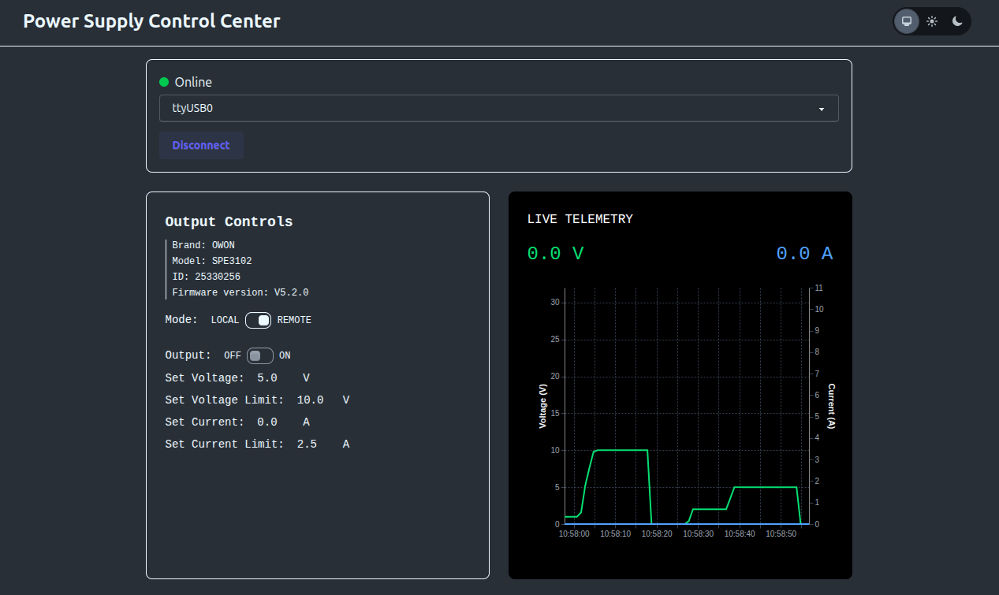

# Owon SPE Power Supply Control Center

A fault-tolerant IoT gateway for the **Owon SPE 3102** Programmable Power Supply. This project demonstrates a modern approach to industrial hardware orchestration, built with **Elixir**, **Nerves**, and **Phoenix LiveView**,



## 🏗 System Architecture

The project is structured as a multi-app repository to ensure a strict separation of concerns:

* **`psu_interface`**: A library that exposes the SCPI commands through a non-blocking `GenServer` architecture that uses `Circuits.UART` to handle hardware communication.
* **`ui`**: A Phoenix LiveView web application. It provides a real-time, responsive dashboard with low-latency telemetry visualization using **Vega-Lite**.
* **`psu_nerves`**: The deployment wrapper that packages the UI and Interface into a minimal, read-only firmware image for any of the supported nerves targets.

---

## ✨ Features

* **Automatic Recovery:** If the USB cable is pulled, the `psu_interface` detects the `enoent` error, notifies the UI.
* **Process Isolation:** A crash in the Serial parser cannot take down the Web Server.
* **PubSub Integration:** Telemetry is broadcasted via `Phoenix.PubSub`. Multiple web clients can monitor the PSU simultaneously without additional hardware overhead.
* Leveraging **Vega-Lite** and **Phoenix JS Hooks**, the telemetry charts are rendered on the client side. The server only pushes lightweight JSON data points, reducing CPU usage on the server.

---

## 🛠 Tech Stack

* **Language:** Elixir (Erlang/BEAM VM)
* **Framework:** Phoenix (LiveView, PubSub)
* **Embedded:** Nerves Project (Buildroot-based firmware)
* **Hardware Interface:** SCPI over USB-Serial (`Circuits.UART`)
* **Visuals:** Vega-Lite (Declarative Graphics), Tailwind CSS

---

## 📖 Getting Started

### Development (Local Machine)
To run the UI and Interface on your laptop with the PSU plugged in:
```bash
cd ui
mix deps.get
iex -S mix phx.server
```

### Production (Nerves)
To burn the firmware to an SD card for the Raspberry Pi:
```bash
# generate a secret key base
cd ui
mix compile
export SECRET_KEY_BASE=$(mix phx.gen.secret)
# compile firmware and burn to SD card
cd ../psu_nerves
export MIX_TARGET=rpi4
export WIFI_SSID=
export WIFI_PSK=
export MIX_ENV=prod
mix deps.get
mix firmware
mix burn
```

---

## ⚠️ Safety Note
Always ensure a physical emergency stop is accessible when working with high-power laboratory equipment.
